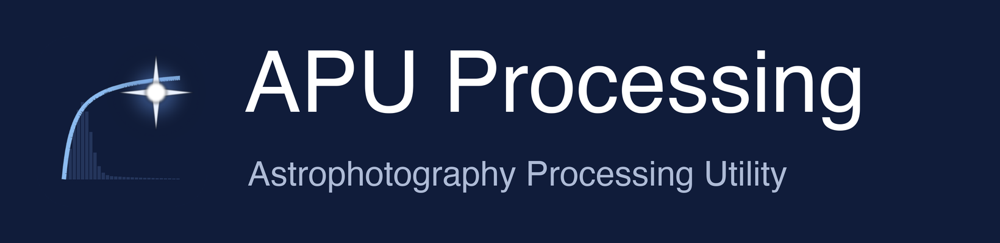
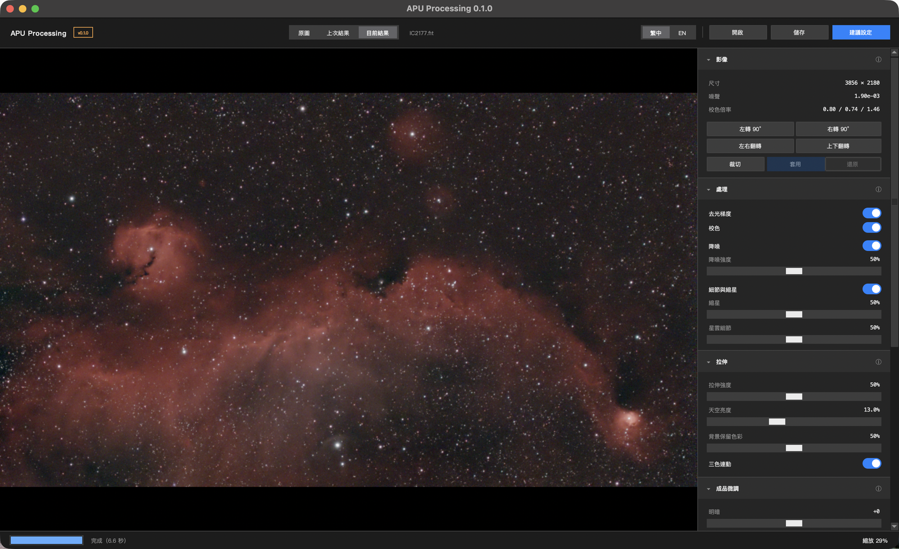

<p align="center">
  
</p>

把疊好的天文照片一鍵後製成品的工具：去光梯度、校色、降噪、縮星與星雲細節、自動拉伸，開檔就自動做完，
再用曲線、明暗、對比、飽和度微調。APU Astro 系列的後製軟體，Mac 與 Windows 同一套程式。



*IC2177（海鷗星雲），開檔後用建議設定自動處理，約 7 秒*

## 特色

- **一鍵到位**：開檔就依序做去光梯度 → 校色 → 降噪 → 縮星與星雲細節 → 拉伸，不用自己排順序、調參數
- **拉伸看噪聲決定深淺**：乾淨的素材拉得深、噪聲多的拉得淺，噪聲不會被拉出來。拉伸曲線以 17 組實拍的人工後製成品校準
- **降噪不變塑膠、不變色塊**：壓掉細顆粒與彩色噪聲、保留星雲結構，留下約一半自然的顆粒感
- **縮星不留黑圈**：只處理星點本身、背景不動；很大的亮星與飽和星保持原樣
- **不靠星表校色**：用畫面裡星點的平均顏色做白平衡
- **背景保留色彩**：滿版 Hα 星雲的暗處可以保留暗紅、反射星雲保留藍色，也可以調成中性的天空
- **成品微調即時預覽**：明暗、對比、飽和度、去綠、主控／紅／綠／藍曲線，拖滑桿時不用重新處理
- **原圖／上次結果／目前結果**一鍵切換比較，縮放與位置不變
- 裁切、旋轉 90°、左右／上下翻轉，都不會改到原始檔
- 讀 FITS（`.fit`、`.fits`、`.fts`，彩色或單色）、TIFF、PNG；存 PNG、JPEG、16-bit TIFF 成品，或 32-bit 浮點的線性 FITS
- 介面可以切換繁體中文 / English；Mac 與 Windows 同一套程式

## 下載

到 [Releases 頁面](../../releases/latest) 下載對應的檔案，不用另外安裝 Python：

| 系統 | 檔案 |
|---|---|
| Windows 10 / 11（64 位元） | `APUProcessing-版本-win64.zip` |
| Mac（Apple M 系列晶片） | `APUProcessing-版本-macos-arm64.zip` |
| Mac（Intel 處理器） | `APUProcessing-版本-macos-x86_64.zip` |

不知道自己的 Mac 是哪一種？點左上角蘋果選單 →「關於這台 Mac」，晶片寫 Apple M1、M2… 就是 M 系列，寫 Intel 就是 Intel。

**Windows**：在 zip 上按右鍵 →「全部解壓縮」，雙擊 `APUProcessing.exe`。出現「Windows 已保護您的電腦」時，
按「其他資訊」→「仍要執行」（程式沒有購買數位簽章）。

**Mac**：解壓後把 `APUProcessing.app` 拖到「應用程式」。第一次開啟被擋下時，按「完成」，
再到「系統設定」→「隱私權與安全性」→ 往下捲到「安全性」，按「強制打開」（程式沒有購買 Apple 的付費簽章）。之後雙擊就能直接開。

## 使用方式

1. 按右上角 **開啟**（Mac ⌘O／Windows Ctrl+O），選一張**未拉伸的線性影像**（疊圖軟體直接輸出的 FITS）；Mac 也可以把檔案拖到程式圖示上
2. 開啟後自動用建議設定處理：大圖會先出快速預覽，再換成完整結果，完成時間顯示在最下面的狀態列
3. 右側面板的開關或滑桿，停手 0.3 秒後自動更新；上方「**原圖／上次結果／目前結果**」可以切換比較
4. 「**成品微調**」只重畫畫面，可以放心拖；曲線雙擊空白處新增控制點、雙擊控制點刪除
5. 疊圖邊緣有壞邊時，按「**裁切**」拖出要保留的範圍再按「**套用**」；「**還原**」回到原本的樣子
6. 滑鼠滾輪或觸控板縮放（以游標為中心），拖曳平移，雙擊回到符合視窗
7. 按 **儲存**：PNG／JPEG／TIFF 存成品（含成品微調），FITS 存線性處理結果，可以再拿去別的軟體處理

右側每一組標題旁的 ⓘ 有詳細說明；右上角「繁中｜EN」切換介面語言。

## 常見問題

**畫面太暗或太亮？**

調右側「拉伸」的**拉伸強度**。預設 50% 會依噪聲自動決定深淺，噪聲多的素材會刻意拉淺一點。

**背景太紅或太藍？**

調「拉伸」裡的**背景保留色彩**（預設 50%），0% 是中性的天空。程式分不出暗處是光害的底色還是微弱的星雲，所以留給你決定。

**星點周圍怪怪的、或不想縮星？**

關掉「處理」裡的**細節與縮星**，或把**縮星**調低。很大的亮星與飽和星本來就不會縮。

**顏色跟用星表校色的結果不一樣？**

這裡用星點的平均顏色白平衡、不靠星表，星場的平均星色偏紅或偏藍的目標會有差異。可以用成品微調的紅／綠／藍曲線修，
或關掉「校色」，把已經校好色的檔案直接丟進來。

**Mac 上看起來比較軟？**

Mac Retina 螢幕上，這套介面顯示影像的解析度是原生的一半（放大到 200% 以上就沒有差別），存出來的檔案不受影響。

## 意見回饋

有問題或建議，直接到 Threads 私訊我：[@apu_astrophotography](https://www.threads.com/@apu_astrophotography)

也可以到 [Issues](../../issues) 留言。

## 開發

需要 Python 3.12。Mac 系統內建的 python3 是 3.9＋Tk 8.5 不能用，請用 uv 的 Python 3.12.11（Tk 8.6），並把 `lib/tcl8.6`、`lib/tk8.6` 連結到虛擬環境裡。

```sh
python -m venv .venv
.venv/bin/pip install -e ".[dev]"          # Windows：.venv\Scripts\pip
.venv/bin/python -m pytest -q
.venv/bin/apu-processing-gui               # 開視窗
.venv/bin/apu-processing 輸入.fit -o 成品.png  # 命令列
```

打包成可以直接執行的程式（PyInstaller 不能跨平台，Mac 版在 Mac、Windows 版在 Windows 打包）：

```sh
.venv/bin/pip install -e ".[exe]" matplotlib   # matplotlib 只給 astropy 的打包 hook 掃描用，不會打包進去
.venv/bin/python packaging/build_exe.py        # → dist/APUProcessing-<版本>-<平台>.zip，打包完自動跑一次冒煙測試
```

`tools/scorecard/` 是評分工具：把處理結果跟人工後製成品在各尺度比較（細節保留、噪聲、色塊、亮星黑斑、星點大小、色調），
需要對應的測試素材（不在這個 repo 裡）。

## 授權

[MIT License](LICENSE)
